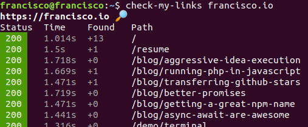
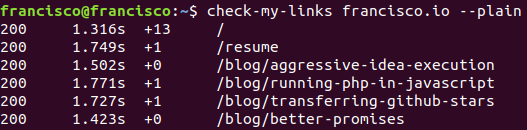
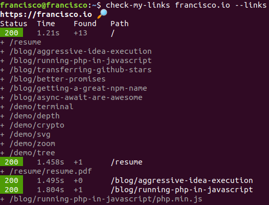

# Check my links

A small CLI tool to make sure your website doesn't have any 404s or 500s:

```bash
$ check-my-links francisco.io
https://francisco.io 🔎
Status  Time    Found   Path
200     0.604s  +13     /
200     0.275s  +1      /resume
200     0.324s  +0      /blog/running-php-in-javascript
...
```



Features:

- Visual hierarchy and colors; green = OK, red = problem, gray = meta information.
- Follows UNIX conventions of separating elements with '\t'.
- Use `--help` for further CLI instructions.
- Use the flag `--plain` for even better and easier CLI usage. You can pipe that out easily.
- Use the flag `--links` for more insight of where the broken links come from.

## Getting started

Install the library with npm:

```bash
npm i check-my-links -g
```

Use it by giving it a url:

```bash
check-my-links francisco.io
check-my-links picnicss.com
```

For more help or to check the version:

```bash
check-my-links --help
check-my-links --version
```

## --plain

Removes the header, the colors and the spaces around it. Ideal for further CLI processing:



## --links

Adds the link information to help debug where the broken links comes from:


